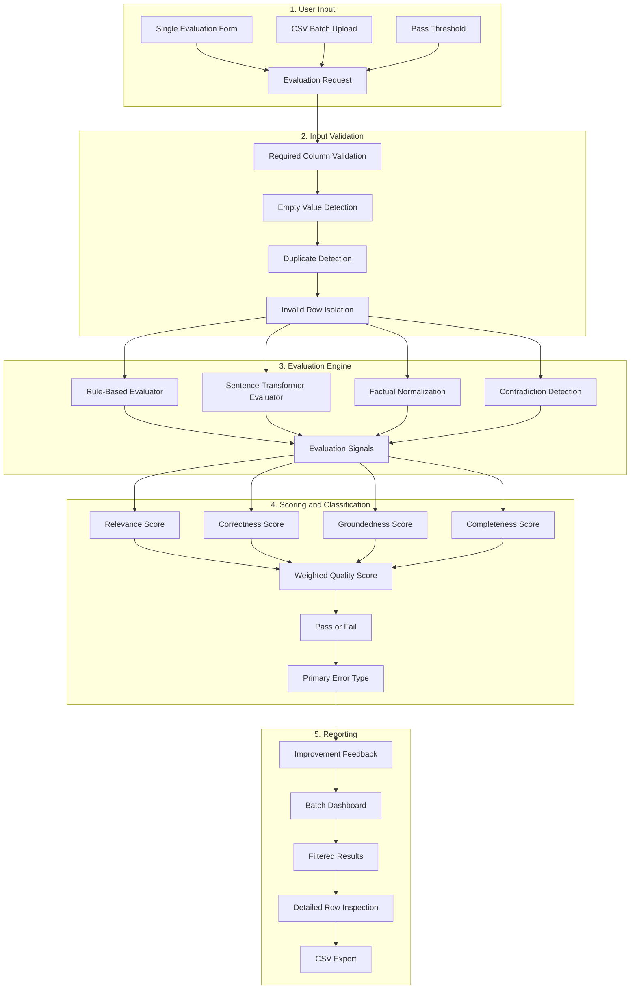

# LLM Evaluation Toolkit

A professional offline evaluation application for measuring the quality of answers produced by LLM, RAG, chatbot, and agent systems using deterministic rules, local semantic similarity, contradiction detection, explainable metrics, and CSV batch analysis.


---

## Overview

LLM Evaluation Toolkit is an offline answer-quality evaluation application designed for testing outputs generated by:

- Large Language Models
- Retrieval-Augmented Generation systems
- Chatbots
- AI agents
- Question-answering pipelines
- Internal AI applications

The toolkit evaluates model outputs entered manually or uploaded through CSV files.

It does not inspect:

- Model architecture
- Model parameters
- Model weights
- Training data
- Provider infrastructure

Instead, it evaluates the generated answer itself using a hybrid evaluation pipeline that combines:

- Deterministic rule-based checks
- Local semantic similarity
- Factual normalization
- Contradiction detection
- Metric aggregation
- Error classification
- Improvement feedback

The default evaluator works without OpenAI, Claude, Gemini, Ollama, or another external LLM API.

---

## Key Features

- Evaluate a single model response
- Evaluate multiple responses through CSV batch processing
- Calculate a quality score from 0 to 100
- Classify every result as Pass or Fail
- Measure answer relevance
- Measure expected-answer correctness
- Estimate context groundedness
- Measure answer completeness
- Identify a primary error type
- Generate deterministic improvement feedback
- Use a local sentence-transformer model
- Detect factual contradictions
- Detect named-entity conflicts
- Detect numeric conflicts
- Detect date and year conflicts
- Detect percentage conflicts
- Detect duration conflicts
- Detect Yes/No conflicts
- Detect negated factual statements
- Detect opposite values such as approved and rejected
- Recognize equivalent durations
- Recognize equivalent percentages
- Recognize equivalent storage units
- Recognize abbreviations and expanded terms
- Detect repeated questions
- Detect generic unwanted refusals
- Detect placeholder answers
- Detect formatting problems
- Validate required CSV columns
- Isolate invalid rows safely
- Detect empty required values
- Detect duplicate rows
- Adjust the Pass threshold
- Filter results by status
- Filter results by error type
- Inspect individual rows in detail
- Display summary dashboard metrics
- Export enriched evaluation results to CSV
- Separate Demo Mode from Full Local Mode
- Run without external API keys
- Include automated Pytest coverage
- Include a six-row downloadable sample dataset
- Include a 100-case regression benchmark used during development

---

## Evaluation Workflow

```text
Question and Answer
        |
        v
Input Validation
        |
        v
Rule-Based Checks
        |
        v
Semantic Similarity Evaluation
        |
        v
Factual Normalization
        |
        v
Contradiction Detection
        |
        v
Metric Aggregation
        |
        v
Pass / Fail Classification
        |
        v
Error Type and Improvement Feedback
        |
        v
Dashboard and CSV Export
```

---

## System Architecture



---

## Evaluation Architecture

The project uses a layered evaluation design instead of relying on a single similarity score.

### 1. Input Validation

The ingestion layer checks:

- Whether required CSV columns exist
- Whether required values are empty
- Whether duplicate rows exist
- Whether rows can be evaluated safely

Invalid rows are isolated instead of crashing the full batch process.

### 2. Rule-Based Evaluation

The deterministic rule layer checks for:

- Empty answers
- Extremely short answers
- Incomplete answers
- Question repetition
- Excessive repetition
- Placeholder responses
- Generic refusals
- Formatting issues
- Excessive verbosity
- Insufficient answer content

### 3. Semantic Similarity Evaluation

The semantic layer uses:

```text
sentence-transformers/all-MiniLM-L6-v2
```

It compares:

- Answer against question
- Answer against expected answer
- Answer against context

The model is downloaded during first use and then reused from the local cache.

### 4. Factual Normalization

The toolkit normalizes equivalent expressions before judging them as conflicts.

Examples:

```text
two weeks = 14 days
one quarter = 25%
halfway = 50%
one gigabyte = 1024 megabytes
seven = 7
nine = 9
RAG = Retrieval-Augmented Generation
CPU = Central Processing Unit
API = Application Programming Interface
```

### 5. Contradiction Detection

The evaluator identifies incompatible factual values when the same factual slot contains different answers.

Examples:

```text
Riyadh vs Jeddah
14 days vs 30 days
Approved vs Rejected
10% vs 20%
2024 vs 2025
Port 8501 vs Port 8080
```

### 6. Metric Aggregation

Available metric scores are combined using configured weights.

If an optional input is missing, its metric becomes unavailable and the remaining metric weights are normalized.

### 7. Classification and Feedback

The final pipeline determines:

- Quality score
- Pass or Fail
- Primary error type
- Improvement feedback

This makes the evaluation explainable instead of returning only a single numerical score.

---

## Evaluation Metrics

| Metric | Required Input | Default Weight |
|---|---|---:|
| Relevance | Question and answer | 25% |
| Correctness | Expected answer | 35% |
| Groundedness Estimate | Context | 25% |
| Completeness | Answer and quality rules | 15% |

The final `quality_score` ranges from:

```text
0 to 100
```

The default Pass threshold is:

```text
70
```

A response passes when:

- Its quality score reaches the configured threshold
- No critical primary error is detected

### Missing Optional Inputs

When `expected_answer` is missing:

```text
Correctness = N/A
```

When `context` is missing:

```text
Groundedness = N/A
```

The evaluator normalizes the remaining available weights automatically.

---

## Error Types

The toolkit can classify evaluation results into error categories such as:

- No Error
- Empty Answer
- Irrelevant Answer
- Incorrect Answer
- Incomplete Answer
- Unsupported Answer
- Contradictory Answer
- Overly Verbose
- Unwanted Refusal
- Formatting Issue
- Insufficient Data

### Example Classifications

```text
Answer: Jeddah is the capital of Saudi Arabia.
Expected: Riyadh is the capital of Saudi Arabia.
Result: Contradictory Answer
```

```text
Answer: What is the capital of Saudi Arabia?
Question: What is the capital of Saudi Arabia?
Result: Incomplete Answer
```

```text
Answer: I'm sorry, but I cannot answer that question.
Question: What does API stand for?
Result: Unwanted Refusal
```

Every failed result includes deterministic feedback explaining the main issue and the weakest evaluation area.

---

## Application Modes

The project separates hosted portfolio testing from full local evaluation.

| Mode | External API Keys | Evaluation Engine | Intended Use |
|---|---|---|---|
| Demo Mode | Not required | Hosted offline evaluator | Quick hosted testing |
| Full Local Mode | Not required | Local sentence-transformer and rules | Private and larger evaluations |

Both modes use the offline evaluation pipeline.

V1 does not accept:

```text
OPENAI_API_KEY
ANTHROPIC_API_KEY
GEMINI_API_KEY
```

No external LLM provider is required for evaluation.

---

## Demo Mode

Demo Mode is designed for hosted portfolio deployment.

In this mode:

- No API key is required
- Single Evaluation is available
- CSV Batch Evaluation is available
- The six-row sample dataset is available
- Hosted resources are used
- File size may be limited
- Available memory may be limited
- Processing speed may be limited
- The application remains suitable for quick testing

Demo Mode is enabled using:

```env
APP_MODE=demo
```

The hosted demo is not recommended for:

- Private datasets
- Sensitive company data
- Large CSV files
- Heavy evaluation workloads

---

## Full Local Mode

Full Local Mode runs the complete evaluation workflow on the user's machine.

In this mode:

- No external API key is required
- The sentence-transformer model runs locally
- Input data remains on the user's machine
- Single Evaluation is available
- CSV Batch Evaluation is available
- Larger datasets can be evaluated
- Local cached model loading is supported
- Private evaluation workflows are possible

Full Local Mode is enabled using:

```env
APP_MODE=local
```

If `APP_MODE` is missing, empty, or invalid, the application defaults safely to Local Mode.

The mode value is case-insensitive.

Examples:

```text
local → local
LOCAL → local
Demo → demo
invalid-value → local
```

---

## Supported Input Format

### Single Evaluation

Required fields:

```text
question
answer
```

Optional fields:

```text
expected_answer
context
```

### Batch Evaluation

| Column | Required | Description |
|---|---:|---|
| `question` | Yes | Original user question or prompt |
| `answer` | Yes | Generated answer being evaluated |
| `expected_answer` | No | Reference answer used for correctness |
| `context` | No | Supporting material used for groundedness |
| `id` | No | Optional user-provided row identifier |

Invalid rows, missing required columns, empty required values, and duplicate rows are isolated safely.

---

## Batch Evaluation Dashboard

The batch dashboard displays:

- Total evaluated responses
- Passed responses
- Failed responses
- Pass rate
- Average quality score
- Average relevance score
- Average correctness score
- Average groundedness score
- Average completeness score
- Error-type distribution
- Lowest-scoring examples
- Filterable result table
- Detailed row inspection
- Evaluated CSV export

### Results Summary

The summary makes Pass and Fail immediately visible.

Example:

```text
Total Evaluated: 100
Passed: 38
Failed: 62
Pass Rate: 38%
Average Quality: 64.5
```

### Result Filtering

Results can be filtered by:

- Status
- Error Type

### Detailed Row Inspection

Each evaluated row can be inspected individually.

The detail view includes:

- Status
- Quality score
- Error type
- Question
- Answer
- Expected answer
- Context
- Relevance
- Correctness
- Groundedness
- Completeness
- Improvement feedback

### CSV Export

The exported file preserves the original columns and adds:

```text
relevance_score
correctness_score
groundedness_score
completeness_score
quality_score
status
error_type
improvement_feedback
evaluation_mode
evaluated_at
evaluator_version
```

---

## Sample Dataset

The repository includes an official six-row sample file:

```text
data/sample_evaluations.csv
```

The same file can be downloaded from the Batch Evaluation page.

It includes:

- Correct factual answer
- Contradictory answer
- Equivalent duration
- Question repetition
- Unwanted refusal
- Correct answer without context

The sample produces a balanced demonstration of:

```text
3 Pass
3 Fail
```

The file is intentionally small so users can test the full evaluation workflow quickly.

---

## Benchmark Evaluation

A separate 100-case benchmark dataset was used during development.

### Benchmark Composition

```text
Total Cases: 100
Expected Pass: 38
Expected Fail: 62
```

The benchmark included:

- Correct factual answers
- Valid paraphrases
- Equivalent durations
- Equivalent percentages
- Equivalent storage units
- Named-entity contradictions
- Numeric contradictions
- Date contradictions
- Irrelevant answers
- Incomplete answers
- Question repetition
- Unwanted refusals
- Unsupported answers
- Placeholder answers
- Missing optional fields

### Final Benchmark Result

```text
100 of 100 classifications matched the expected labels
False Positives: 0
False Negatives: 0
```

This benchmark was created specifically around:

- Implemented rules
- Supported contradiction cases
- Supported normalization cases
- Supported equivalence cases
- Regression scenarios discovered during testing

It is a regression benchmark.

It should not be interpreted as proof of universal 100% accuracy on:

- Unseen datasets
- Specialized industries
- Other languages
- Complex long-form reasoning
- Medical evaluation
- Legal evaluation
- Financial evaluation
- Open-ended factual judgment

---

## Tech Stack

| Category | Technology |
|---|---|
| Programming language | Python |
| User interface | Streamlit |
| Semantic evaluation | Sentence Transformers |
| Embedding model | all-MiniLM-L6-v2 |
| Data processing | Pandas |
| Numerical operations | NumPy |
| Model runtime | PyTorch |
| Configuration | python-dotenv |
| Testing | Pytest |
| Input format | CSV |
| Export format | CSV |
| Evaluation style | Offline hybrid evaluation |

---

## Project Structure

```text
LLM-Evaluation-Toolkit/
├── app.py
│
├── assets/
│
├── data/
│   └── sample_evaluations.csv
│
├── src/
│   ├── config/
│   │   └── Application settings and scoring weights
│   │
│   ├── evaluators/
│   │   ├── Rule-based evaluation
│   │   ├── Semantic evaluation
│   │   ├── Factual normalization
│   │   └── Contradiction detection
│   │
│   ├── ingestion/
│   │   └── CSV loading and validation
│   │
│   ├── pipeline/
│   │   └── Single and batch evaluation orchestration
│   │
│   ├── reporting/
│   │   ├── Feedback generation
│   │   ├── Summary generation
│   │   └── CSV export
│   │
│   ├── scoring/
│   │   ├── Metric aggregation
│   │   └── Error classification
│   │
│   └── ui/
│       ├── Streamlit pages
│       ├── Reusable components
│       └── Application styling
│
├── tests/
│
├── .streamlit/
│   └── config.toml
│
├── .env.example
├── .gitignore
├── LICENSE
├── README.md
└── requirements.txt
```

---

## Installation

### 1. Clone the repository

```bash
git clone https://github.com/Azoqoz/LLM-Evaluation-Toolkit.git
cd LLM-Evaluation-Toolkit
```

### 2. Create a virtual environment

#### Windows

```powershell
py -m venv .venv
.venv\Scripts\activate
```

#### macOS / Linux

```bash
python3 -m venv .venv
source .venv/bin/activate
```

### 3. Install the dependencies

#### Windows

```powershell
py -m pip install -r requirements.txt
```

#### macOS / Linux

```bash
python3 -m pip install -r requirements.txt
```

The sentence-transformer model downloads automatically during the first semantic evaluation.

After the initial download, the model is reused from the local cache.

---

## Environment Configuration

Copy `.env.example` to `.env`.

### Windows

```powershell
copy .env.example .env
```

### macOS / Linux

```bash
cp .env.example .env
```

The example environment file contains:

```env
# Allowed values: local or demo
APP_MODE=local
```

### Local Mode

```env
APP_MODE=local
```

### Demo Mode

```env
APP_MODE=demo
```

The `.env` file:

- Is used for the user's local configuration
- Is excluded from Git
- Should not be committed

The `.env.example` file:

- Documents the required variables
- Is included in the repository
- Can be copied by other users

If `APP_MODE` is missing or invalid, the application defaults to:

```text
local
```

---

## Running the Application

### Standard Local Run

```bash
streamlit run app.py
```

Streamlit will display a local URL, typically:

```text
http://localhost:8501
```

Open the displayed URL in your browser.

### Demo Mode

#### Windows PowerShell

```powershell
$env:APP_MODE = "demo"
py -m streamlit run app.py
```

#### macOS / Linux

```bash
export APP_MODE=demo
python3 -m streamlit run app.py
```

### Full Local Mode

#### Windows PowerShell

```powershell
$env:APP_MODE = "local"
py -m streamlit run app.py
```

#### macOS / Linux

```bash
export APP_MODE=local
python3 -m streamlit run app.py
```

---

## CSV Format

Example:

```csv
id,question,answer,expected_answer,context
1,What is the capital of Saudi Arabia?,Riyadh is the capital of Saudi Arabia.,The capital of Saudi Arabia is Riyadh.,Riyadh is the capital and largest city of Saudi Arabia.
```

Required columns:

```text
question
answer
```

Optional columns:

```text
id
expected_answer
context
```

The application safely reports:

- Missing columns
- Empty required fields
- Invalid rows
- Duplicate rows

---

## Testing

Run the complete automated test suite with:

### Windows

```powershell
py -m pytest -q
```

### macOS / Linux

```bash
python3 -m pytest -q
```

Final verified result:

```text
94 passed
0 failed
```

The test suite covers:

- Application mode configuration
- Missing and invalid environment values
- Single evaluation
- Batch evaluation
- CSV validation
- Missing required columns
- Empty required values
- Duplicate isolation
- Semantic scoring
- Rule-based checks
- Factual normalization
- Contradiction detection
- Equivalent durations
- Equivalent percentages
- Equivalent units
- Question repetition
- Unwanted refusals
- Pass and Fail consistency
- Dashboard rendering
- Filtering
- Row details
- CSV export

### Windows Cache Warning

A local Pytest warning may appear when Windows prevents creation of:

```text
.pytest_cache
```

Example:

```text
PytestCacheWarning: could not create cache path
```

This warning is related to local folder permissions.

It does not indicate a failed project test.

---

## Deployment

The application can be deployed using Streamlit Community Cloud.

Recommended configuration:

```text
Repository: Azoqoz/LLM-Evaluation-Toolkit
Branch: main
Main file path: app.py
```

Set the deployment environment variable:

```text
APP_MODE=demo
```

The hosted application does not require:

```text
OPENAI_API_KEY
GEMINI_API_KEY
ANTHROPIC_API_KEY
```

The evaluator does not call external LLM providers in V1.

Hosted-resource limitations may affect:

- File size
- Memory
- Speed
- Large batch evaluation

Full Local Mode is recommended for private data and larger workloads.

---

## Screenshots

### Single Evaluation — Pass Result

<!-- Add screenshot: assets/single-evaluation-pass.png -->

### Single Evaluation — Fail Result

<!-- Add screenshot: assets/single-evaluation-fail.png -->

### Batch Evaluation Dashboard

<!-- Add screenshot: assets/batch-evaluation-dashboard.png -->

---

## Extensibility and Real-World Use

The current evaluator is designed around general-purpose English question-answering scenarios.

Its modular architecture separates:

- Input validation
- Rule-based evaluation
- Semantic evaluation
- Factual normalization
- Contradiction detection
- Metric scoring
- Error classification
- Feedback generation
- Dashboard rendering
- CSV export

This structure can serve as a foundation for evaluating:

- RAG applications
- Customer-support chatbots
- Internal knowledge assistants
- AI agents
- Document question-answering systems
- Search assistants
- Enterprise LLM applications
- Prompt experiments
- Model-version comparisons
- Regression datasets

Potential extensions include:

- Domain-specific rules
- Custom metric weights
- Industry evaluation profiles
- Provider-based LLM-as-a-Judge evaluation
- Direct API-based evaluation
- Multi-turn conversation evaluation
- Claim-level groundedness
- Agent tool-call evaluation
- Experiment tracking
- Automated deployment gates

The current repository does not provide these advanced features out of the box.

---

## Current Limitations

- Semantic similarity does not guarantee factual correctness
- The evaluator is not a universal factual judge
- Groundedness is an estimate rather than citation-level verification
- Long answers may contain unsupported claims not detected individually
- Rule thresholds may require domain-specific calibration
- The first semantic evaluation requires internet access to download the model
- English is the primary tested language
- Multilingual performance has not been comprehensively validated
- Domain-specific terminology may require additional normalization rules
- Complex mathematical reasoning is not formally verified
- Medical conclusions are not clinically validated
- Legal conclusions are not legally validated
- Financial conclusions are not financially validated
- Hosted performance depends on available memory and CPU resources
- Large datasets may require local execution
- The 100-case benchmark is a regression benchmark rather than proof of universal accuracy
- V1 does not include an external LLM-as-a-Judge
- V1 does not evaluate model weights or training quality
- V1 does not directly connect to RAG or Agent APIs

---

## Future Improvements

- Add optional LLM-as-a-Judge evaluation
- Add OpenAI judge support
- Add Anthropic Claude judge support
- Add Google Gemini judge support
- Add local Ollama judge support
- Add direct RAG API evaluation
- Add direct Agent API evaluation
- Add multi-turn conversation evaluation
- Add tool-call evaluation
- Add claim-level groundedness analysis
- Add citation verification
- Add domain-specific evaluation profiles
- Add custom metric weights
- Add experiment comparison
- Add model-version comparison
- Add prompt-version comparison
- Add persistent evaluation history
- Add database storage
- Add FastAPI backend
- Add Docker support
- Add continuous integration
- Add automated quality gates
- Add automated deployment
- Add multilingual benchmark datasets
- Add larger independent benchmark datasets

---

## Why This Project Matters

This project demonstrates that evaluating LLM applications requires more than checking whether two answers use similar words.

A practical evaluation system should combine:

- Input validation
- Semantic similarity
- Deterministic rules
- Factual normalization
- Contradiction detection
- Explainable metrics
- Error classification
- Regression testing

The project demonstrates practical AI Engineering skills, including:

- LLM output evaluation
- RAG quality evaluation
- Agent-response evaluation
- Sentence-transformer integration
- Offline AI evaluation
- Rule-based NLP
- Factual contradiction detection
- Equivalent-value normalization
- Semantic similarity scoring
- Dataset validation
- CSV batch processing
- Explainable scoring
- Error classification
- Feedback generation
- Regression benchmark design
- Streamlit application development
- Modular software architecture
- Automated testing
- Environment-based application modes
- Safe hosted-demo design
- Local privacy-oriented execution

The project shows how an AI application can evaluate generated outputs locally while providing transparent scores, classifications, and actionable feedback.

---

## Author

Developed by [Azoqoz](https://github.com/Azoqoz).
